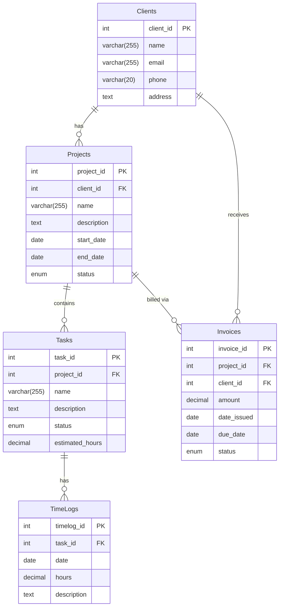

# ER Diagram for Freelancer Project Tracker Database

```mermaid
erDiagram
    Clients ||--o{ Projects : "has"
    Projects ||--o{ Tasks : "contains"
    Tasks ||--o{ TimeLogs : "has"
    Projects ||--o{ Invoices : "billed via"
    Clients ||--o{ Invoices : "receives"

    Clients {
        int client_id PK
        varchar(255) name
        varchar(255) email
        varchar(20) phone
        text address
    }

    Projects {
        int project_id PK
        int client_id FK
        varchar(255) name
        text description
        date start_date
        date end_date
        enum status
    }

    Tasks {
        int task_id PK
        int project_id FK
        varchar(255) name
        text description
        enum status
        decimal estimated_hours
    }

    TimeLogs {
        int timelog_id PK
        int task_id FK
        date date
        decimal hours
        text description
    }

    Invoices {
        int invoice_id PK
        int project_id FK
        int client_id FK
        decimal amount
        date date_issued
        date due_date
        enum status
    }
```